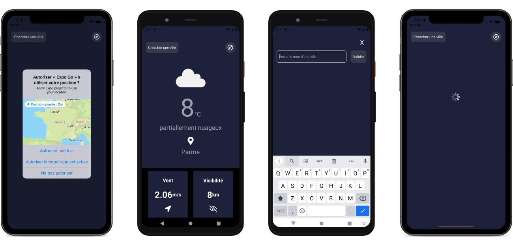

# Weather app

Mobile Weather app carried out with `React native`. The data, quite approximate, comes from OpenWeather 's API, with a good management of errors.

# Overview

The easiest way to test the application is:

1. Install [Expo Go](https://expo.dev/client) on your mobile phone form Apple or Google Store.
2. Go to this [link](https://expo.dev/@yousoumar/weather) and scan the QR code.

